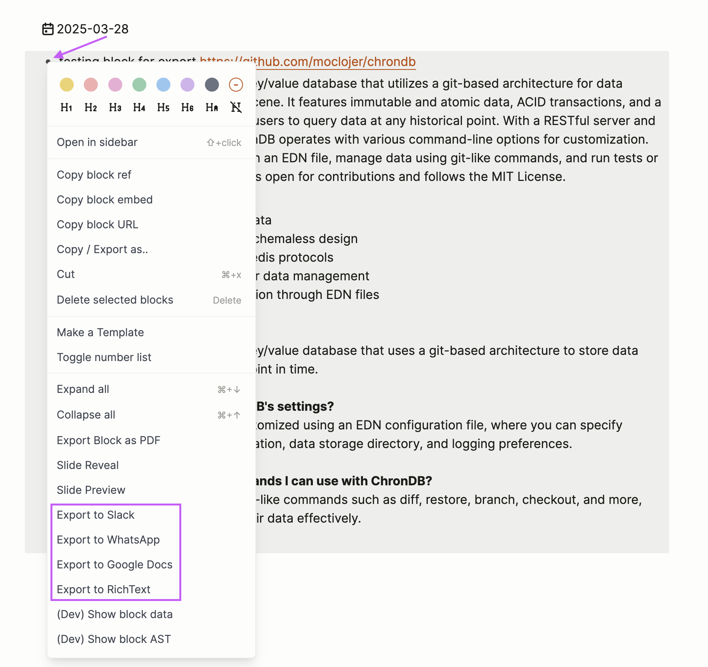

# Logseq Export Block

A Logseq plugin that allows you to export blocks to various formats with proper formatting, ready to be pasted into different applications.

## Features

- Export Logseq blocks with their children to multiple formats
- Maintain formatting and indentation appropriate for each target platform
- Copy directly to clipboard for easy pasting
- Support for rich text formatting where applicable
- Available directly from the block context menu

## Supported Export Formats

- **Slack**: Optimized formatting for Slack messages with proper link conversion and Slack-specific syntax
- **WhatsApp**: Clean formatting that works well with WhatsApp's limited markup
- **Google Docs**: Rich text formatting for better document integration
- **Rich Text**: General purpose rich text export

## Installation

1. In Logseq, go to `Settings > Plugins`
2. Click on `Marketplace`
3. Search for "Export Block"
4. Click `Install`

## Usage

1. Right-click on any block in Logseq
2. From the context menu, select one of the export options:
   - `Export to Slack`
   - `Export to WhatsApp`
   - `Export to Google Docs`
   - `Export to RichText`
3. The block and its children will be copied to your clipboard in the selected format
4. Paste the content into your target application



## How It Works

The plugin processes your Logseq blocks and their children, applying format-specific transformations:

- Converts Logseq's markdown-style formatting to the appropriate syntax for each platform
- Handles links, lists, and indentation according to each platform's requirements
- For rich text formats (Slack, Google Docs), provides both plain text and HTML versions for better pasting results
- Uses modern clipboard APIs with fallbacks for maximum compatibility

## Development

This plugin is built with TypeScript and uses the Logseq Plugin API.

### Building from source

```bash
# Install dependencies
npm install

# Build the plugin
npm run build
```

## License

Created by [@avelino](https://github.com/avelino)
